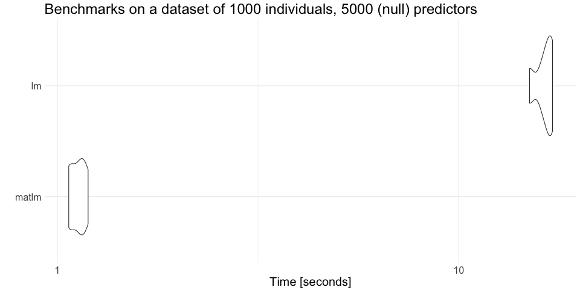

# matlm

## About

The `matlm` R package fits linear models in matrix form and avoids calling `lm`.
That makes computation efficient if many predictors need to be tested 
and calling `lm` for every marker creates considerable overhead in computation time.

Features (to be implemented):

- Split a set of predictors into batches
    - Parallel computation
- Support different formats to store predictors: `matrix`, `big.matrix`, etc
    - Use S3 classes for the interface
- Allow for GLS models (not only OLS)
