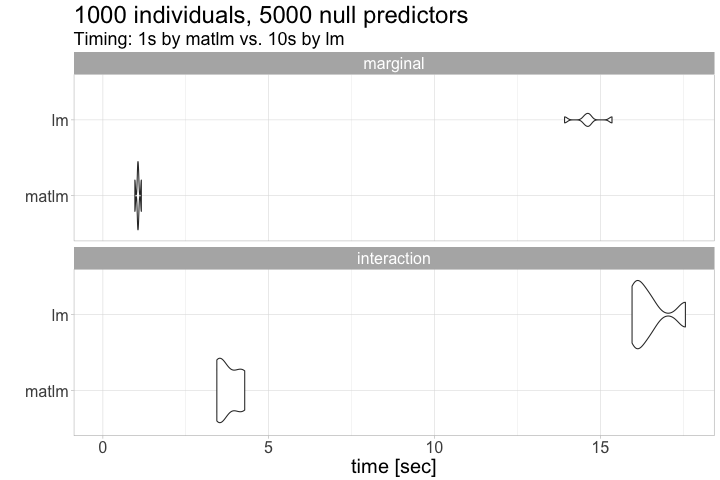

# matlm

Source: [docs/R/01-figure-timing-assoc.R](docs/R/01-figure-timing-assoc.R)

## About

The `matlm` R package fits linear models in matrix form and avoids calling `lm`.
That makes computation efficient if many predictors need to be tested,
while calling `lm` for every predictor results in a considerable overhead in computation time.

### References

- Vignettes
    - [Computation of linear models in matlm](https://variani.github.io/matlm/vignettes/computation.html)
    - [Correlated tests statistics](https://variani.github.io/matlm/vignettes/corstat.html)

### Features 

(yet to be implemented)

- Split a set of predictors into batches
    - Parallel computation
- Support different formats to store predictors: `matrix`, `big.matrix`, etc
    - Use S3 classes for the interface
- Run GLS models (not only OLS)

## Similar tools/methods

- [GWAS on your notebook: fast semi-parallel linear and logistic regression for genome-wide association studies](https://bmcbioinformatics.biomedcentral.com/articles/10.1186/1471-2105-14-166)
