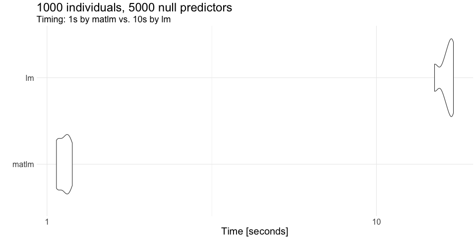

```{r options, echo = F}
opts_chunk$set(comment = NA, results = 'markup', tidy = F, message = F, warning = F, echo = T,
  fig.width = 3, fig.height = 3)
```

# About

The `matlm` R package (https://github.com/variani/matlm) fits linear models in matrix form and avoids calling `lm`. 
That makes computation efficient if many predictors need to be tested, 
while calling lm for every predictor results in a considerable overhead in computation time.

The development of our package was inspired by the `MatrixEQTL` R package [@Shabalin2012].
The basic idea is that for a simple linear regression:

$y = \mu + \beta x + e$

$e \sim \mathcal{N}(0, \sigma_e^2)$

the test statistic of association between $y$ and $x$ (t-test) can be calculated 
using the sample correlation $r = cor(y, x)$:

$t = \sqrt{N - 2} \frac{r}{\sqrt{1 - r^2}}$

Further, when testing M predictors $X = [x_1, x_2, \dots, x_M]$,
the computation takes the form of matrix multiplication operations.
If a single outcome is tested, then we compute the cross-product
of $y$ and $X$.
If there are many outcomes or the permutation of $y$ is sought,
then we have a matrix $Y = [y_1, y_2, \dots, y_L]$ and
we compute the cross-product of $Y$ and $X$.

Features available in `MatrixEQTL`:

- splitting data in $X$ into batches;
- orthogonalization of $y$ and $x$ due to other covariates (age, gender, population stratification);
- transformation of $y$ and $x$ when the residual errors are correlated, $e \sim \mathcal{N}(0, V)$;
- parallel computation.

Features implemented or to be implemented in `matlm` (apart from the features in `MatrixEQTL`):

- support for storage of $X$ in different format (out-memory netCDF and hdf5);
- interaction tests;
- permutation tests on outcome;
- permutation tests on predictors;
- bootstrapping on the test statistics;
- correction for correlated statistics.

## Is `matlm` fast?

Here you see a comparison between `lm` and `matlm` (the main function of the package):




# Background

## Linear model with a single predictor

Here we prove the formula for the t-test statistic $t = \sqrt{N - 2} \frac{r}{\sqrt{1 - r^2}}$
for the linear model with a single predictor:

$y = \mu + \beta x + e$

$e \sim \mathcal{N}(0, \sigma_e^2)$

The model is simplified further if we center both $y$ and $x$.

$y = \beta x + e$

$e \sim \mathcal{N}(0, \sigma_e^2)$

The ordinary least squares (OLS) solution is the following:

$\hat{\beta} = \frac{x^T y}{x^T x} \sim \mathcal{N}(\beta, \frac{\sigma_e^2}{x^T x})$

Consequently, the test statistic is computed as:

$t = \frac{\hat{\beta}}{\hat{\sigma}_e} \sqrt{x^T x} = \frac{1}{\hat{\sigma}_e} \frac{x^T y}{\sqrt{x^T x}}$

where 

$\hat{e} = y - \beta x$

$\hat{\sigma}_e = \sqrt{\frac{\hat{e}^T \hat{e}}{N - 2}}$


### Standardized variables

Standardization of $y$ and $x$ leads to $y^T y = 1$, $x^T x = 1$ and $x^T y = r$ (the correlation coefficient).

$\hat{\sigma}_e = \sqrt{\frac{1 - r^2}{N - 2}}$

$t = \sqrt{\frac{N - 2}{1 - r^2}} r$


## Orthogonalization of covariates

We consider a model which includes a covariate of interest $x$ 
and other covariates stored in columns of matrix $C$
(the columns of 1s is also included in $C$ and represents the mean term).

$y = C \beta_C + \beta x + e$

$e \sim \mathcal{N}(0, \sigma_e^2)$

### The Gram-Schmidt process

Based on https://cran.r-project.org/web/packages/matlib/vignettes/gramreg.html, 
the Gram-Schmidt process treats the variables in $C$ one by one and start with a new matrix $Z$ consisting of `C[, 1]`. 

Then, a new variable `Z[, 2]` is such that it is orthogonal to `Z[, 1]`.
That is accomplished by subtracting the projection of `X[, 2]` on `Z[, 1]`.

R code for `C` with three columns:

```
Z <- cbind(C[, 1], 0, 0)
Z[, 2] <- C[,2] - proj(C[, 2], Z[, 1])
```

where

```
proj <- function(z, x) crossprod(t(z), crossprod(z, x)) / as.numeric(crossprod(z))
```

Next:

```
Z[, 3] <- C[, 3] - proj(C[, 3], Z[, 1]) - proj(C[, 3], Z[, 2]) 
```

The columns of $Z$ are now orthogonal (but not of unit length).

### QR decomposition

The QR decomposition of $C = Q R$ performs the Gram-Schmidt process.
The _orthonormal_ $Q$ matrix corresponds to $Z$.

### Orthogonalization of covariance in linear model

$y = C \beta_C + \beta x + e$

$e \sim \mathcal{N}(0, \sigma_e^2)$

If $C = Q R$, then a path to the following (simplified) model

$y = \beta x + e$

$e \sim \mathcal{N}(0, \sigma_e^2)$

consists in the following operations (R code):


```
y_orth <- y - proj(y, Q[, 1]) - proj(y, Q[, 2]) - proj(y, Q[, 3])
x_orth <- x - proj(x, Q[, 1]) - proj(x, Q[, 2]) - proj(x, Q[, 3])
```

## Interaction model

$y = \mu + \beta_x x + \beta_d d + \beta_{int} x * d + e$

$e \sim \mathcal{N}(0, \sigma_e^2)$

Strategies to compute the statistic for the interaction term:

- orthogonalize  out $x$ and $d$ from $x * d$ 
    - not as efficient as for the marginal analysis, as this operation involves $X$
      and $X$ is a large matrix of $M$ predictors
- apply some custom formulas as shown in [@Aschard2016]      

# References


